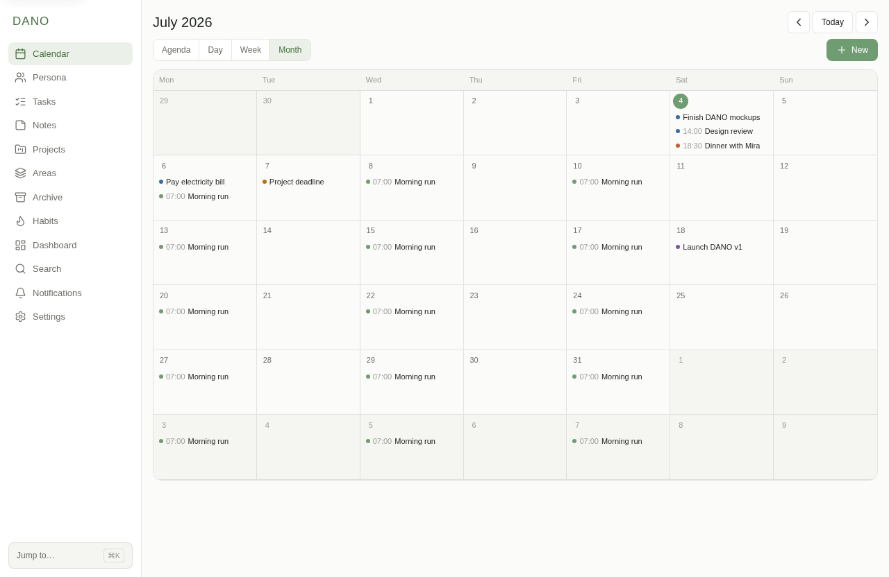
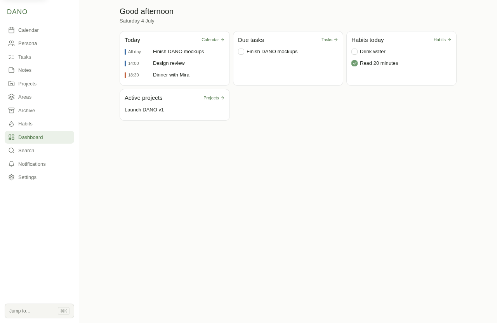
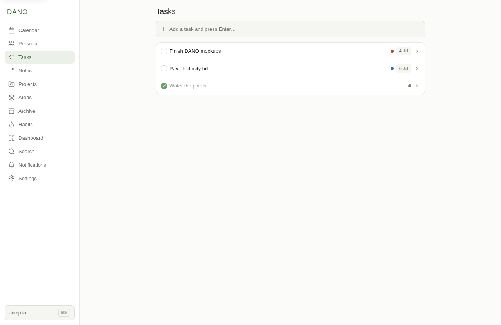

<div align="center">

# DANO

**A calm, private home for your whole life.**

Calendar, tasks, notes, projects, and habits in one app that runs on your own
computer, works offline, and keeps your data to yourself.

Windows · macOS · Linux · phone coming soon

</div>

<div align="center">



</div>

## What it does

- A calendar that shows everything with a date in a single view: events, task due dates, project deadlines, and birthdays.
- Tasks with due dates, priorities, and links to the project or person they belong to.
- Notes you can attach to a task, project, area, or person.
- Projects grouped under the areas of your life, each with its own tasks and notes.
- Habits you tick off day by day, with streaks.
- A dashboard for what matters today, plus reminders when something is overdue.
- Search that covers all of it at once.

| Dashboard | Tasks |
| --- | --- |
|  |  |

## Your data stays yours

Your data lives on your device. No account to create, and nothing gets uploaded to a server. Close the lid on a plane and it still works.

## Made for everyone

DANO is built for people who find most apps tiring or overwhelming. The interface is calm and compact instead of large and empty, with one soft green accent and thin, quiet lines. You can change the density, theme, contrast, and text size, and switch on reading aids when you want them. Making the app usable for everyone was the point from the first screen, not an afterthought.

## Download

Get the installer for your system from the [Releases page](https://github.com/xUniti/dano/releases):

- **Windows** — run the `.exe` installer
- **macOS** — open the `.dmg` and drag DANO to Applications
- **Linux** — `.deb`, `.rpm`, or `.AppImage`

The apps are not signed yet, so your system may warn you the first time you open one. On Windows, click "More info" and then "Run anyway". On macOS, right-click the app and choose "Open".

## Status

DANO is early but already usable. The core is in place: calendar, people, tasks, notes, projects, areas, habits, dashboard, search, and reminders. Multi-device sync and phone apps come next.

## Build from source

DANO is open source. You need [Node](https://nodejs.org) and [Rust](https://rust-lang.org) installed, then:

```sh
npm install
npm run tauri:dev
```

## License

MIT. See [LICENSE](LICENSE).
